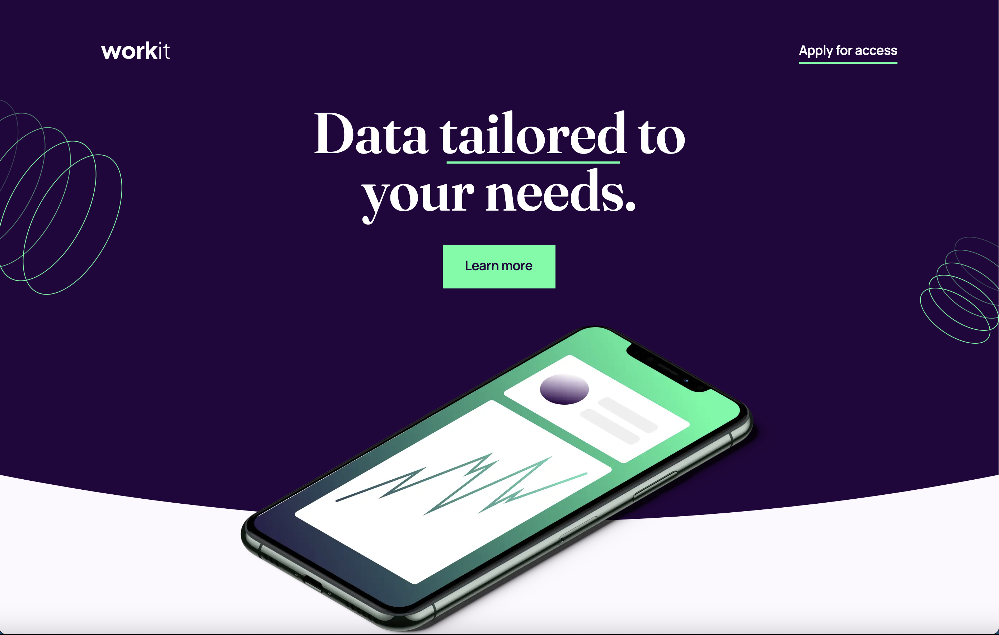
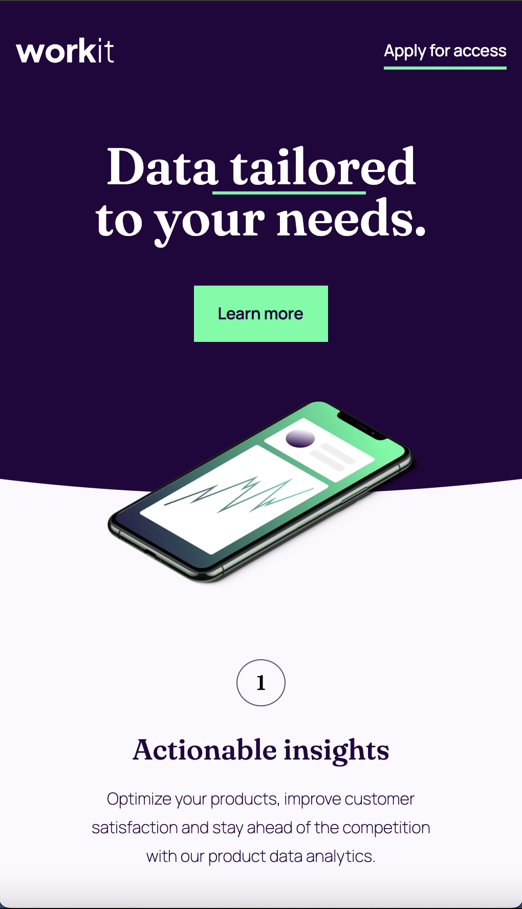

# Frontend Mentor - Workit landing page solution

This is a solution to the [Workit landing page challenge on Frontend Mentor](https://www.frontendmentor.io/challenges/workit-landing-page-2fYnyle5lu). Frontend Mentor challenges help you improve your coding skills by building realistic projects.

## Table of contents

- [Overview](#overview)
  - [The challenge](#the-challenge)
  - [Screenshot](#screenshot)
  - [Links](#links)
- [My process](#my-process)
  - [Built with](#built-with)
  - [What I learned](#what-i-learned)
  - [Continued development](#continued-development)
  - [Useful resources](#useful-resources)
- [Author](#author)
- [Acknowledgments](#acknowledgments)

## Overview

After taking a break from frontend development (focusing on more CS-related concepts as well as school), I wanted to jump back in and renew my Frontend Mentor membership. So I did. I went through the premium challenges and decided on this one (Workit Landing Page) in order to check my HTML and CSS skills. I always underestimate how long these will take, and this one took about 16 hours longer than anticipated. Very fun though!

### The challenge

Users should be able to:

- View the optimal layout for the interface depending on their device's screen size
- See hover and focus states for all interactive elements on the page

### Screenshot

<table>
  <tr>
    <td align="center">
      
    </td>
  </tr>
  <tr>
    <td align="center">
      
      
    </td>
  </tr>
</table>

### Links

- Solution URL: [Add solution URL here](https://your-solution-url.com)
- Live Site URL: [https://workitlanding.netlify.app/](https://workitlanding.netlify.app/)

## My process

- I opened a terminal (I like iTerm), navigated to the path I wanted to build this project, created and moved into a new directory, and created appropriate files.
- I forgot there was a starter file provided with this project, so I copy and pasted only the content from the starter file as well as the assets.
- Maybe it's a bad habit, but I typically start developing for the desktop first.
- After the starter code was all set up, I began by creating a reset CSS file, followed by a config CSS file, then set up the root selector in that config file and setting the variables provided in the design system (colors, fonts, buttons, links, etc.).
- I created reusable classes where I could and employed the root variables.
- I applied the desktop styling to every element in the HTML file.
- I overlaid my live-server project over the design file in Figma to get everything to match up the best I could.
- I then rinsed and repeated for tablets, using a media query. Same for mobile.
- I ran into a few snafus while fine-tuning, but I got it taken care of.
- After every major development, I would commit the code with the appropriate message.
- I wrote this README based on the template provided.

### Built with

- Semantic HTML5 markup
- CSS custom properties
- Flexbox
- Desktop-first workflow (will adapt to mobile-first for future projects)

### What I learned

- I learned about the importance of a proper CSS reset as opposed to using the universal selector. In this project I used Eric Meyer's CSS Reset (see below).
- Not related to the project, but I learned how to add a table to this README file to display images how I'd like.
- I both reinforced my knowledge of HTML and CSS and learned deeper about accessability and CSS organization for readability and maintainability.
- I gained deeper insight into the use of aria-labels to improve the accessibility of HTML elements for users with disabilities by providing descriptive labels for interactive elements like links and buttons.
- I expanded my understanding of the importance of semantic HTML.
- While I typically use Google Chrome for development, this time I used FireFox and their development tools. I still prefer Chrome.
- I learned a bit about the CSS property 'clip-path.' SVG shapes are something that's really interesting to me and am going to explore it more.
- While this project only included ttf font types, I learned the importance of different font types, ttf, woff, and woff2.

### Continued development

- Font types
- SVG shapes
- Accessability
- Markdown
- FireFox
- For my next Frontend Mentor project, I'd like to explore Vue.
- I would also like to explore creating a project mobile-first.

### Useful resources

- [Eric Meyers CSS Reset](https://meyerweb.com/eric/tools/css/reset/) - Eric Meyer's CSS reset eliminates cross-browser inconsistencies and streamlines the styling process, providing a uniform base across all browsers. This approach improves code maintainability and layout predictability.

## Author

- Website (under constuction) - [Steve Xero](https://www.stevexero.com)
- Old website - [Old Site](https://www.steven-woodward.com)
- Frontend Mentor - [@stevexero](https://www.frontendmentor.io/profile/stevexero)
- X - [@steve_xero](https://www.twitter.com/steve_xero)
